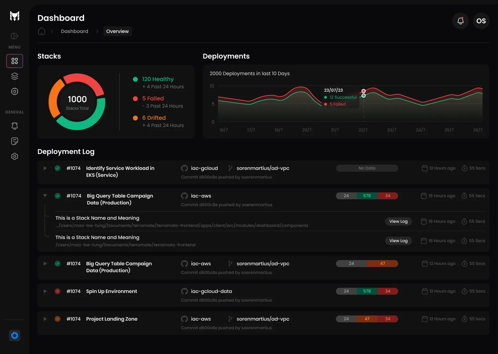

<p align="center">
  <picture width="160px" align="center">
      <source media="(prefers-color-scheme: dark)" srcset="https://raw.githubusercontent.com/terramate-io/brand/5a799813d429116741243b9b06a9f034a3991bf3/darkmode/stamp.svg">
      
    </picture>
  <h1 align="center">Terramate</h1>
  <p align="center">
    ✨ <a href="https://terramate.io/docs/cli">https://terramate.io</a> ✨
    <br/>
    Terramate CLI is an open-source Infrastructure as Code (IaC) orchestration tool that <strong>unifies</strong>,
    <strong>simplifies</strong>, and <strong>scales</strong> all your infrastructure code, tools, and workflows.
  </p>
</p>
<br/>

<p align="center">
  <a href="https://github.com/terramate-io/terramate/releases"></a>
  <a href="https://pkg.go.dev/github.com/terramate-io/terramate"></a>
  <a href="https://goreportcard.com/report/github.com/terramate-io/terramate"></a>
  <a href="https://github.com/terramate-io/terramate/actions?query=branch%3Amain"></a>
  <a href="https://github.com/terramate-io/terramate/stargazers" rel="nofollow"></a>
  <a href="https://terramate.io/discord" rel="nofollow"></a>
</p>

<p align="center">
  <a href="https://terramate.io/docs/cli">📖 Documentation</a> | <a href="https://terramate.io/docs/cli/getting-started">🚀 Getting Started</a> | <a href="https://play.terramate.io">💻 Playground</a> | <a href="https://jobs.ashbyhq.com/terramate" title="Terramate Job Board">🙌 Join Us</a>
</p>

<br>
<br>

## What is Terramate CLI?

Terramate CLI is an open-source Infrastructure as Code (IaC) **orchestration tool** for Terraform, OpenTofu, Terragrunt,
Pulumi, Cloud Formation, CDK, Azure Resource Manager (ARM), Kubernetes, and others, that **unifies**, **simplifies** and
**scales** all your infrastructure code, tools, and workflows.  

The main value proposition of Terramate CLI is to simplify the management and improve the scalability of your
Infrastructure as Code projects by using a modular and efficient approach called Terramate Stacks.

## Quick Install

With brew:

```sh
brew install terramate
```

With Go:

```sh
go install github.com/terramate-io/terramate/cmd/...@latest
```

## Getting Started

The fastest way to get started with Terramate is our [getting started guide](https://terramate.io/docs/cli/getting-started/).


## **What are Terramate Stacks?**

Terramate Stacks are **modular**, **standardized,** and **tooling-agnostic units** that represent a set of
infrastructure resources. They are often used to group, organize and manage various isolated components of an
application or infrastructure and support technologies such as Terraform, OpenTofu, Terragrunt, CDK, Pulumi,
Cloud Formation, Azure Resource Manager (ARM),  Kubernetes (Helm, kubectl, Kustomize), and others. 

You can think about a stack as a combination of **source code**, the **current state** of the managed infrastructure
(e.g., Terraform state file), and **configuration**.


There are several benefits to using Terramate Stacks:

✅ **Limit the blast radius and risk of infrastructure changes**

✅ **Significantly faster run times and lower costs**

✅ **Better ownership management and governance**

✅ **Improved productivity and developer experience while reducing complexity**

✅ **Better observability and security**

✅ **Enables multi-step and multi-IaC use cases**

Terramate Stacks can be cloned, nested, compared and orchestrated. You can also generate code in stacks to keep them
DRY (e.g., generate files such as the Terraform backend configuration for all stacks that manage Terraform resources).

Terramate Stacks are created using a single command.

```sh
terramate create path/to/new/stack
```

## What is an IaC orchestrator?

An orchestrator allows you to execute commands in stacks while defining the order of execution, dependencies, and more.
Terramate CLI comes with a powerful orchestration and execution engine that allows you to easily invoke commands in stacks.

```sh
terramate run <CMD>
```

Terramate CLI also comes with a change detection, that seamlessly integrates with git enabling you to execute commands
in stacks that contain changes only.

E.g., invoke `terraform apply` in all stacks that contain changes:

```sh
terramate run --changed -- terraform plan
```

Another example is to invoke a command in all stacks that have the tags `k8s`and`prd`, and that contain changes.

```sh
terramate run --changed --tags k8s:prd -- kubectl apply
```

Terramate CLI is designed and implemented by long-time DevOps, Cloud and Platform Engineering practitioners based on
previous experience working with large-scale platforms in some of the most sophisticated companies in the world.
It focuses on significantly improving the developer experience and productivity and integrates with existing tooling
in a non-intrusive way without major lock-ins and for a broader audience.

If you like Terramate CLI, please give the project a ⭐ and join our [Discord Community](https://discord.gg/CyzcScEPkc).

## What are the most common use cases of Terramate CLI?

📈 **Implement and maintain highly scalable IaC projects**

Stacks unlock faster execution, better collaboration, and lower blast radius risk. With stacks, parallel deployment
ensures no more pipeline run bottlenecks.

🔗 **GitOps workflows that run in your existing CI/CD platform**

Unlock CI/CD workflows to orchestrate your stacks in your existing CI/CD platform, such as GitHub Actions, GitLab and
Bitbucket Pipelines. Can be used to **preview changes and plans in Pull Requests** or to **detect infrastructure drift**
with scheduled runs.

🏎 **Deploy significantly faster and more often**

Change detection allows you to execute only commands in stacks that have been changed in the current branch or since
the last merge, reducing CI/CD runtimes to a bare minimum, even in complex environments, **saving costs** and
**improving throughput.**

👷 **Better developer productivity and experience**

Simplified management and improved productivity by providing developer-centric workflows like one-click cloning stacks
and environments. Enable developers to use templates to deploy complex infrastructure without requiring them to
learn the complexity of IaC.

⚒️ **Data Sharing**

Share data across stacks with globals that can be inherited, merged, or overwritten in your stack hierarchy. Use input
and output data from one stack and IaC technology as input data in another. 

💫 **Code Generation**

Keep your code DRY by automatically generating and updating repetitive code, such as the Terraform provider and
backend configuration. Always generates native code that integrates seamlessly with third-party tooling.

## Terramate Cloud

**Terramate Cloud** provides you with the best IaC management experience possible. It helps you orchestrate your stacks
in your existing CI/CD platform, such as GitHub Actions, GitLab and Bitbucket Pipelines, so you don't need to buy yet
another CI/CD vendor.

It also provides a powerful dashboard that adds **observability** and **insights**, **deployment metrics**
(e.g., **DORA**), **notifications**, **drift management**, **asset management,** and more for your stacks to provide
the developer experience and infrastructure to build, scale and observe all your infrastructure managed with IaC.



## Join the Community

- Join our [Discord](https://discord.gg/CyzcScEPkc)
- Contact us via email at [hello@terramate.io](mailto:hello@terramate.io)
- Follow us on [X](https://twitter.com/terramateio)
- Follow us on [LinkedIn](https://www.linkedin.com/company/terramate-io)

## Additional Resources

- [Documentation](https://terramate.io/docs/cli/)
- [Playground](https://play.terramate.io/)
- [Getting started guide](https://terramate.io/docs/cli/getting-started/)
- [Terramate Blog](https://blog.terramate.io/)
- [Terramate VSCode Extension](https://github.com/mineiros-io/vscode-terramate)

## Reporting Bugs, Requesting Features, or Contributing to Terramate

Want to report a bug or request a feature? Open an [issue](https://github.com/terramate-io/terramate/issues/new)

Interested in contributing to Terramate? Check out our [Contribution Guide](https://github.com/terramate-io/terramate/blob/main/CONTRIBUTING.md)

## License

See the [LICENSE](./LICENSE) file for licensing information.

## Terramate

Terramate is a [CNCF](https://landscape.cncf.io/?item=app-definition-and-development--continuous-integration-delivery--terramate)
and [Linux Foundation](https://www.linuxfoundation.org/membership/members/) silver member.


