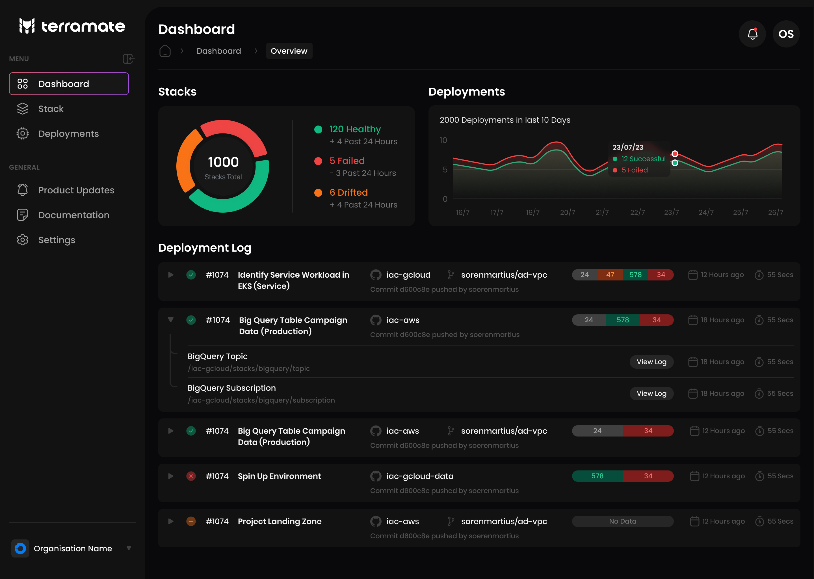

<p align="center">
  <picture width="160px" align="center">
      <source media="(prefers-color-scheme: dark)" srcset="https://raw.githubusercontent.com/terramate-io/brand/5a799813d429116741243b9b06a9f034a3991bf3/darkmode/stamp.svg">
      
    </picture>
  <h1 align="center">Terramate</h1>
</p>
<br/>

<p align="center">
  <a href="https://github.com/terramate-io/terramate/releases"></a>
  <a href="https://pkg.go.dev/github.com/terramate-io/terramate"></a>
  <a href="https://goreportcard.com/report/github.com/terramate-io/terramate"></a>
  <a href="https://github.com/terramate-io/terramate/actions?query=branch%3Amain"></a>
  <a href="https://terramate.io/discord" rel="nofollow"></a>
</p>

<p align="center">
  <a href="https://terramate.io/docs/cli/getting-started">🚀 Getting Started</a> | <a href="https://terramate.io/docs/cli">📖 Documentation</a> |  <a href="https://play.terramate.io">💻 Playground</a>
   <!-- | <a href="https://jobs.ashbyhq.com/terramate" title="Terramate Job Board">🙌 Join Us</a> -->
</p>

<br>
<br>

## What is Terramate CLI?

Terramate CLI is an open-source Infrastructure as Code (IaC) code generation and orchestration tool for Terraform,
OpenTofu and Terragrunt. With Terramate, you can:

(a) **Simplify complex codebases** to make your work more productive and reliable. Break down large state files with
stacks to reduce run-time and blast radius and keep them DRY with native code generation.

(b) **Automate and orchestrate Terraform, OpenTofu and Terragrunt in any CI/CD** using Pull Request automation, GitOps
blueprints, and workflow tooling with zero-config orchestration and change detection.

(c) **Provide the foundation to later leverage Terramate Cloud**, a management layer that gives you visibility, control, and actionable insights into your infra.

## Installation

With brew:

```sh
brew install terramate
```

With Go:

```sh
go install github.com/terramate-io/terramate/cmd/...@latest
```

For other installation methods, please see the [documentation](https://terramate.io/docs/cli/installation).


## Getting Started

The fastest way to get started with Terramate is our [getting started guide](https://terramate.io/docs/cli/getting-started/).

## Why simplify complex codebases?

As Terraform and OpenTofu offer no standard pattern on how to organize code efficiently, projects quickly sprawl out of
control. The consequences are ***code complexity***, ***long-running pipelines***,
***large blast radius***, ***drift***, and ***poor governance***.

Terramate CLI enables a new approach to eliminating the root cause of these consequences: using a modular and efficient
approach called Terramate Stacks. A stack is a combination of infrastructure code, state and configuration, which can be
nested to split state further.

Organizationally, a stack is a way to establish an ownership model. By consistently sizing stacks into isolated units
that your team members can quickly understand, assuming ownership of your infra becomes a lot simpler.
Terramate CLI supports Terraform, OpenTofu and Terragrunt, and can be run locally as well as in your existing VCS
(Github, Gitlab) CI/CD.

Terramate CLI is designed to work especially well with [Terramate Cloud](https://cloud.terramate.io), which provides
an IaC management layer and offers a generous free tier. 

## Features

- **Orchestration:** Run any command and configurable workflows in stacks with unlimited concurrency.
- **Change Detection:** Only execute stacks that contain changes. Allows to detect changes in referenced Terraform and
OpenTofu modules as well as Terragrunt dependencies.
- **Code Generation:** Generate code such **HCL**, **JSON** and **YAML** to keep your stacks DRY (Don't repeat yourself). Comes with
support for global variables and functions.
- **Automation Blueprints:** Pre-configured GitOps workflows for GitHub, GitLab, BitBucket and Atlantis to enable Pull
Automation with plan previews in your existing CI/CD.
- **Drift Management:** Detect and reconcile drift with scheduled workflows.
- **Observability, Visibility and Insights:** Provides actionable insights and observability into your stacks, deployments,
and resources.


## Terramate Cloud

[Terramate Cloud](https://cloud.terramate.io?ref=github) provides you with the best IaC management experience possible. It helps you orchestrate your stacks
in your existing CI/CD platform, such as GitHub Actions, GitLab and Bitbucket Pipelines, so you don't need to buy yet
another CI/CD vendor.

It also provides a powerful dashboard that adds **observability** and **insights**, **deployment metrics**
(e.g., **DORA**), **notifications**, **drift management**, **asset management,** and more for your stacks to provide
the developer experience and infrastructure to build, scale and observe all your infrastructure managed with IaC.



## Join the Community

- Join our [Discord](https://discord.gg/CyzcScEPkc)
- Contact us via email at [hello@terramate.io](mailto:hello@terramate.io)
- Follow us on [X](https://twitter.com/terramateio)
- Follow us on [LinkedIn](https://www.linkedin.com/company/terramate-io)

## Additional Resources

- [Documentation](https://terramate.io/docs)
- [Playground](https://play.terramate.io/)
- [Getting started guide](https://terramate.io/docs/cli/getting-started/)
- [Terramate Blog](https://terramate.io/rethinking-iac/)

## Reporting Bugs, Requesting Features, or Contributing to Terramate

Want to report a bug or request a feature? Open an [issue](https://github.com/terramate-io/terramate/issues/new)

Interested in contributing to Terramate? Check out our [Contribution Guide](https://github.com/terramate-io/terramate/blob/main/CONTRIBUTING.md)

## License

See the [LICENSE](./LICENSE) file for licensing information.

## Terramate

Terramate is a [CNCF](https://landscape.cncf.io/?item=app-definition-and-development--continuous-integration-delivery--terramate)
and [Linux Foundation](https://www.linuxfoundation.org/membership/members/) silver member.


