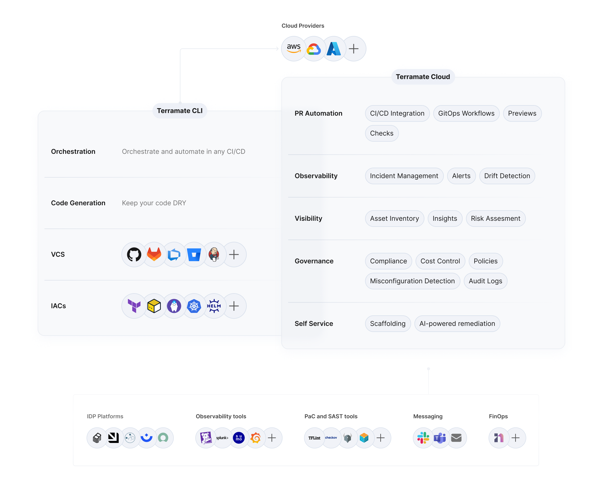

<p align="center">
  <picture width="160px" align="center">
      <source media="(prefers-color-scheme: dark)" srcset="https://raw.githubusercontent.com/terramate-io/brand/5a799813d429116741243b9b06a9f034a3991bf3/darkmode/stamp.svg">
      
    </picture>
  <h1 align="center">Terramate</h1>
</p>
<br/>

<p align="center">
  <a href="https://github.com/terramate-io/terramate/releases"></a>
  <a href="https://pkg.go.dev/github.com/terramate-io/terramate"></a>
  <a href="https://goreportcard.com/report/github.com/terramate-io/terramate"></a>
  <a href="https://github.com/terramate-io/terramate/actions?query=branch%3Amain"></a>
  <a href="https://terramate.io/discord" rel="nofollow"></a>
</p>

<p align="center">
  <a href="https://terramate.io/docs/cli/getting-started">🚀 Getting Started</a> | <a href="https://terramate.io/docs/cli">📖 Documentation</a> |  <a href="https://play.terramate.io">💻 Playground</a>
   | <a href="https://jobs.ashbyhq.com/terramate" title="Terramate Job Board">🙌 Join Us</a>
</p>

<br>
<br>

## What is Terramate?

Terramate CLI is an open-source orchestration and code generation engine that allows Infrastructure as Code (IaC) such
as Terraform, OpenTofu, Terragrunt and Kubernetes to scale.

Terramate CLI can optionally be paired with [Terramate Cloud](https://terramate.io), a fully managed SaaS service that
adds additional features to manage and observe all your infrastructure managed with IaC in one or multiple repositories.

With Terramate, you can:

1. Break up large, monolithic state files into multiple smaller stacks to limit blast radius, reduce runtimes and unlock better collaboration.
2. Reduce code duplication by programmatically generating native Terraform backend and provider configurations or any other arbitrary files using the Terramate compiler.
3. Using a graph-based orchestration engine, orchestrate any command such as `terraform apply` in stacks. Only deploy stacks that contain changes using change detection built on top of Git.
4. Automate your IaC using pull requests and GitOps workflows that turn your existing CI/CD, such as GitHub Actions, GitLab CI/CD, BitBucket Pipelines, Azure DevOps, etc, into infrastructure vending machines.
5. Use Terramate Cloud to add observability, drift detection, asset management, misconfiguration detection, incident management, developer self-service with scaffolding, and Slack notifications.

## Why Terramate?

Terramate is an extremely lightweight approach that can be onboarded to any existing IaC project with a single command
and without touching any existing configurations. Terramate doesn't require access to your state backend, code or
cloud accounts, which makes it safe and secure to use in any environment. When you start using Terramate, you can adopt
it on a per-feature basis, and there's no additional risk because Terramate doesn't inflict any hard lock-in.

If you want to learn more, take a look at our [how it works](https://terramate.io/docs/how-it-works) guide.

## Benefits

- **Instant Onboarding:** Onboard Terramate to any existing architecture with a single step. No refactoring required.
- **Full Flexibility:** Terramate supports any architecture. Workspaces, Directories, Terragrunt, TFVars - we've got you covered.
- **No Lock-in:** On- and off-board Terramate at any point in time. No vendor lock-in is inflicted on you.
- **Bring your CI/CD:** Terramate isn't a CI/CD platform. Instead, use your existing CI/CD, which is cost-efficient and secure.
- **Unlimited Parallelism:** Run highly concurrent workflows that allow teams to collaborate in parallel without causing waiting times.
- **Best Security:** No access to your state or cloud accounts is required. Terramate is secure by design.
- **Developer Experience:** Remove guesswork and config sprawl by imposing structure, workflows and best practices.
- **Unlimited Integrations:** Terramate integrates seamlessly with all your tools, such as GitHub or Slack.
- **Native IaC:** No need to learn a new syntax! With Teramate, everything is configured as code using HCL.
- **Serverless:** Using Terramate doesn't require you to run and maintain any additional infrastructure.

## Installation

### Installing Terramate CLI

Start by installing Terramate CLI.

With brew:

```sh
brew install terramate
```

With Go:

```sh
go install github.com/terramate-io/terramate/cmd/...@latest
```

For other installation methods, please see the [documentation](https://terramate.io/docs/cli/installation).

### Connect the CLI to Terramate Cloud

To get the most out of Terramate, [sign up for a free Terramate Cloud account](https://cloud.terramate.io) and connect
Terramate CLI with your Terramate Cloud account:

```sh
terramate cloud login
```

## Getting Started

Terramate can be onboarded to any existing Terraform, OpenTofu, or Terragrunt with a single command and without requiring
any refactoring. For details, please see the following guides:

- [Start with existing Terraform project](https://terramate.io/docs/cli/on-boarding/terraform)
- [Start with existing OpenTofu project](https://terramate.io/docs/cli/on-boarding/opentofu)
- [Start with existing Terragrunt project](https://terramate.io/docs/cli/on-boarding/terragrunt)
- [Start from scratch](https://terramate.io/docs/cli/getting-started/)

## Features

- **Multiple Environments**: Manage multiple environments using any existing approach such as workspaces, directories, Terragrunt, TFVars, partial backend configuration, and more.
- **Dependencies**: Manage dependencies among environments with output sharing and graph-based orchestration.
- **Orchestration:** Run any command and configurable workflows in stacks with unlimited concurrency.
- **Change Detection:** Only execute stacks that contain changes. Allows to detect changes in referenced Terraform and
OpenTofu modules as well as Terragrunt dependencies.
- **Code Generation:** Generate code such **HCL**, **JSON** and **YAML** to keep your stacks [DRY](https://en.wikipedia.org/wiki/Don%27t_repeat_yourself) (Don't repeat yourself).
- **Automation Blueprints:** Pre-configured GitOps workflows for GitHub Actions, GitLab CI/CD, BitBucket Pipelines and others to enable Pull
Automation with plan previews in your existing CI/CD.
- **Drift Management:** Detect and reconcile drift with scheduled workflows and post-deployment drift detection.
- **Observability, Visibility and Insights:** Provides actionable insights and observability into your stacks, deployments,
and resources.
- **Misconfiguration Detection**: Detect and remediate misconfigurations with more than 500+ pre-configured policies using frameworks such as the Center of Internet Security Benchmarks (CIS).
- **Asset Management**: Get an inventory of all your infrastructure resources managed by multiple teams, environments and repositories. 
- **Audit Trail**: Track and review all infrastructure changes for compliance and security.
- **Alerts**: Manage incidents such as failed deployments or drift with alerts that are automatically assigned to the right teams and individuals.
- **Slack Integrations**: Integrate notifications in a centralized Slack channel or via our Slack Bot to directly notify users without causing notification fatigue.
- **Scaffolding**: Enable developer-self service by allowing developers to scaffold complex infrastructure configurations without having to know tools such as Terraform or Terramate in detail.

## Terramate CLI vs Terramate Cloud

<picture>
  <source media="(prefers-color-scheme: dark)" srcset="./terramate_platform_overview_dark.png">
  
</picture>

## Learn more

- [How does it work?](https://terramate.io/docs/how-it-works)
- [Documentation](https://terramate.io/docs/)
- [Terramate Blog](https://terramate.io/rethinking-iac/)
- [Playground](https://play.terramate.io/)
<!-- - [How-to guides](https://terramate.io/docs/how-it-works) TODO: add video guides-->

## Join the Community

- Join our [Discord](https://terramate.io/discord)
- Follow us on [X](https://twitter.com/terramateio)
- Follow us on [LinkedIn](https://www.linkedin.com/company/terramate-io)
- Contact us via email at [hello@terramate.io](mailto:hello@terramate.io)
****
## Reporting Bugs, Requesting Features, or Contributing to Terramate

Want to report a bug or request a feature? Open an [issue](https://github.com/terramate-io/terramate/issues/new)

Interested in contributing to Terramate? Check out our [Contribution Guide](https://github.com/terramate-io/terramate/blob/main/CONTRIBUTING.md)

## License

See the [LICENSE](./LICENSE) file for licensing information.

## Terramate

Terramate is a [CNCF](https://landscape.cncf.io/?item=app-definition-and-development--continuous-integration-delivery--terramate)
and [Linux Foundation](https://www.linuxfoundation.org/membership/members/) silver member.


