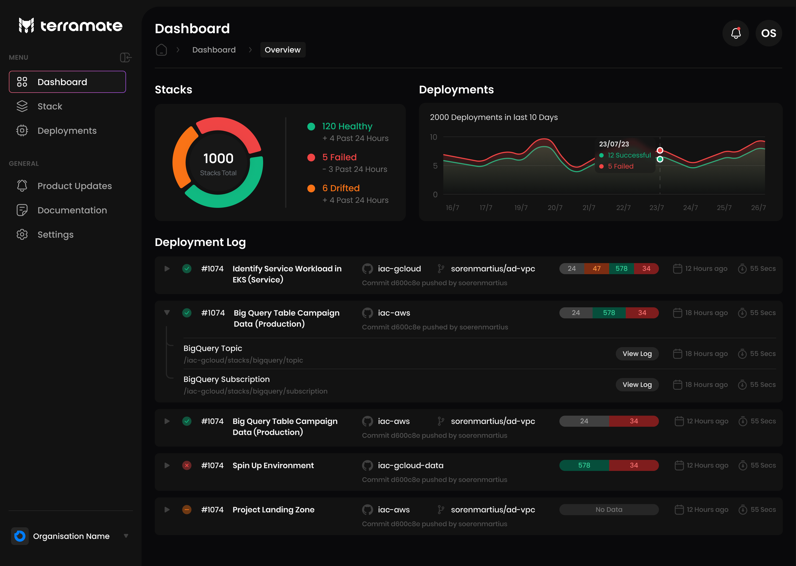

<p align="center">
  <picture width="160px" align="center">
      <source media="(prefers-color-scheme: dark)" srcset="https://raw.githubusercontent.com/terramate-io/brand/5a799813d429116741243b9b06a9f034a3991bf3/darkmode/stamp.svg">
      
    </picture>
  <h1 align="center">Terramate</h1>
</p>
<br/>

<p align="center">
  <a href="https://github.com/terramate-io/terramate/releases"></a>
  <a href="https://pkg.go.dev/github.com/terramate-io/terramate"></a>
  <a href="https://goreportcard.com/report/github.com/terramate-io/terramate"></a>
  <a href="https://github.com/terramate-io/terramate/actions?query=branch%3Amain"></a>
  <a href="https://terramate.io/discord" rel="nofollow"></a>
</p>

<p align="center">
  <a href="https://terramate.io/docs/cli/getting-started">🚀 Getting Started</a> | <a href="https://terramate.io/docs/cli">📖 Documentation</a> |  <a href="https://play.terramate.io">💻 Playground</a>
   | <a href="https://jobs.ashbyhq.com/terramate" title="Terramate Job Board">🙌 Join Us</a>
</p>

<br>
<br>

## What is Terramate?

Terramate is an Infrastructure as Code (IaC) orchestration, observability and visibility platform that allows teams to
deploy and manage infrastructure with Terraform, OpenTofu and Terragrunt efficiently at any scale.

## Why Terramate?

With Terramate, you can:

- **Simplify Complex Codebases:** Split up large state files to lower blast radius and runtimes. Use code generation to
  avoid code duplication.
- **Automate Infrastructure Workflows:** Orchestrate and automate your IaC with GitOps workflows using your own CI/CD.
- **Drift-Free Infrastructure:** Automatically detect and reconcile infrastructure drift.
- **Govern your entire Infrastructure Footprint:** Understand and govern all your infrastructure asset managed
  across multiple teams, repositories, and environments.
- **Multi-Environment Support:** Easily manage multiple environments and promote changes between those.
- **Enable Developer Self-Service:** Drive developer productivity providing a service catalog of production-grade
  infrastructure service that developers can scaffold in self-service without having in-depth IaC knowledge.

Terramate combines powerful code generation, GitOps automation, observability and governance tools with enterprise-ready security and scalability.

## Installation

### Installing Terramate CLI

Start by installing Terramate CLI.

With brew:

```sh
brew install terramate
```

With Go:

```sh
go install github.com/terramate-io/terramate/cmd/...@latest
```

For other installation methods, please see the [documentation](https://terramate.io/docs/cli/installation).

### Connect the CLI to Terramate Cloud

To get the most out of Terramate, [sign up for a free Terramate Cloud account](https://cloud.terramate.io) and connect
Terramate CLI with your Terramate Cloud account:

```sh
terramate cloud login
```

## Getting Started

Terramate can be onboarded to any existing Terraform, OpenTofu, or Terragrunt with a single command and without requiring
any refactoring. For details, please see the following guides:

- [Start with existing Terraform project](https://terramate.io/docs/cli/on-boarding/terraform)
- [Start with existing OpenTofu project](https://terramate.io/docs/cli/on-boarding/opentofu)
- [Start with existing Terragrunt project](https://terramate.io/docs/cli/on-boarding/terragrunt)
- [Start from scratch](https://terramate.io/docs/cli/getting-started/)

## Terramate CLI vs Terramate Cloud


<!--  -->

<!-- ## Features

- **Orchestration:** Run any command and configurable workflows in stacks with unlimited concurrency.
- **Change Detection:** Only execute stacks that contain changes. Allows to detect changes in referenced Terraform and
OpenTofu modules as well as Terragrunt dependencies.
- **Code Generation:** Generate code such **HCL**, **JSON** and **YAML** to keep your stacks DRY (Don't repeat yourself). Comes with
support for global variables and functions.
- **Automation Blueprints:** Pre-configured GitOps workflows for GitHub, GitLab, BitBucket and Atlantis to enable Pull
Automation with plan previews in your existing CI/CD.
- **Drift Management:** Detect and reconcile drift with scheduled workflows.
- **Observability, Visibility and Insights:** Provides actionable insights and observability into your stacks, deployments,
and resources. -->

## Join the Community

- Join our [Discord](https://terramate.io/discord)
- Follow us on [X](https://twitter.com/terramateio)
- Follow us on [LinkedIn](https://www.linkedin.com/company/terramate-io)
- Contact us via email at [hello@terramate.io](mailto:hello@terramate.io)

## Additional Resources

- [Documentation](https://terramate.io/docs)
- [Playground](https://play.terramate.io/)
- [Getting started guide](https://terramate.io/docs/cli/getting-started/)
- [Terramate Blog](https://terramate.io/rethinking-iac/)

## Reporting Bugs, Requesting Features, or Contributing to Terramate

Want to report a bug or request a feature? Open an [issue](https://github.com/terramate-io/terramate/issues/new)

Interested in contributing to Terramate? Check out our [Contribution Guide](https://github.com/terramate-io/terramate/blob/main/CONTRIBUTING.md)

## License

See the [LICENSE](./LICENSE) file for licensing information.

## Terramate

Terramate is a [CNCF](https://landscape.cncf.io/?item=app-definition-and-development--continuous-integration-delivery--terramate)
and [Linux Foundation](https://www.linuxfoundation.org/membership/members/) silver member.


