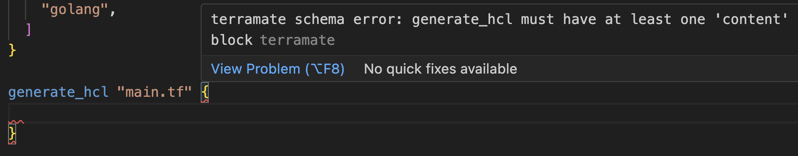

# Language Server (`terramate-ls`)

The `terramate-ls` program is the _Terramate Language Server_, a tool that
implements the [LSP](https://microsoft.github.io/language-server-protocol/) (_Language Server Protocol_)
and then provides the same set of features to all editors that implement the protocol.

The `terramate-ls` is still in early stage development, then it's not battle tested and only 
supports basic features.

## Installation

The `terramate-ls` is distributed alongside the `terramate` binary. Check the [installation page](../installation.md) for details.

For details about how to setup it in your editor, check the [editors](./index.md) documentation.

## Linting

When using `terramate-ls` whenever a file changes or is saved, the editor shows diagnostic messages.

See image below:



## Commands

_The documentation below only matters for editor's plugin maintainers._

### `terramate.createStack`

This command creates a stack in the project's workspace.
The supported arguments are:

- `uri=<target directory>` (**required**): The target directory.
- `genid=true` (_optional_): If the `stack.id` must be generated or not.
- `name=<name of the stack>` (_optional_): The name of the stack.
- `description=<stack description>` (_optional_): The description of the stack.

The command arguments are sent as a list of strings:

```json
["uri=file:///some/path/dir", "name=my stack"]
```
