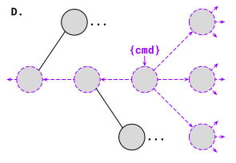
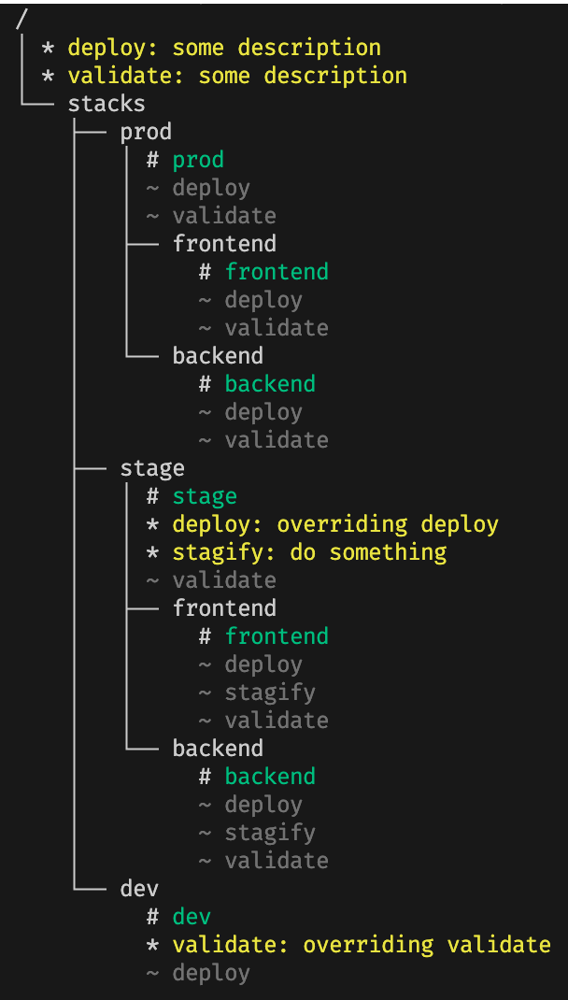

# Configure and run workflows with Terramate Scripts

Workflows are a way of combining multiple commands into one executable unit of work called Terramate Scripts.

## Introduction

When using Terramate CLI, you often encounter scenarios where you want to execute a sequence of commands in stacks.
A typical sequence for a Terraform deployment is:

- `terraform init`
- `terraform validate`
- `tfsec .`
- `terraform apply -auto-approve`

This would typically require you to invoke multiple `terramate run` commands.

The following will execute each step in our defined workflow in stacks:

- `terramate run terraform init`
- `terramate run terraform validate`
- `terramate run tfsec .`
- `terramate run terraform apply -auto-approve`

Terramate CLI would first invoke `terraform init` in all stacks, then continue with `terraform validate`, and so on.

To run the full sequence of commands in each stack they could be executed in a shell:

```sh
terramate run -- sh -c '
  terraform init &&
  terraform validate &&
  tfsec . &&
  terraform apply -auto-approve
  '
```

The example above first executes all listed commands in the first stack before moving on to the next stack.

Terramate Scripts allow you to configure sequences of commands and execute them in a single call, e.g.
`terramate script run`. You do not need to remember the sequence and can not forget a command, no matter if you run the
script in CI/CD or on your local machine.

::: info
Terramate Scripts is a new and experimental feature that might still be subject to changes in the future.
To use this feature it needs to be enabled explicitly in your Terramate config by adding it to `experiments`.

```hcl
# terramate.tm.hcl
  terramate {
    config {
      experiments = [
        "scripts",  # Enable Terramate Scripts
    ]
  }
}
```

:::

## Defining scripts

A script in Terramate CLI is defined in a script block placed in any Terramate configuration file on any level of your project hierarchy. The `script` block has the following syntax:

```hcl
script "command" "subcommand" { # any level of subcommands is supported
  description = "Execute commands"
  job {
    description = "hello world job"
    commands = [
      ["echo", "-n", "Hello"],
      ["echo", " World!"],
    ]
  }
}
```

- The list of labels of the `script` block defines the arguments you need to
  provide to the `terramate script run` command in order to execute the script:
  `terramate script run command subcommand`. You can define any number of labels.
- Attributes and Blocks Reference of the `script` block

  - `name` _(optional)_ - A name for the jobs being executed (maximum of 128 chars)
  - `description` _(optional)_ - A description of the jobs being executed (maximum of 1000 chars)
  - `job` _(required)_ - One or more blocks each defining a sequence of commands to be executed in the script.
    Jobs are executed in the order of definition.

    Each job can have the following attributes:

    - `name` _(optional)_ - A name for the job (maximum of 128 chars).
    - `description` _(optional)_ - A description for the job (maximum of 1000 chars).
    - `commands` _(required)_ - A list of commands. Each item is a list that has the form `[ command, arg1, arg2, ...]`
      that will be executed accordingly. Terramate Functions and variable interpolation of the following namespaces
      is supported: `global`, `terramate`, and `env`
      Optionally, the last item of the argument list can be an object containing Terramate-specific options for this command.
      In this case, the form is extended to `[ command, arg1, arg2, ..., {option1: value1, option2: value2} ]`.
      See below for a list of supported command options.

To run a Terraform deployment, a script can be defined as:

```hcl
script "deploy" {
  description = "Run a Terraform deployment"
  job {
    name        = "deploy"
    description = "Initialize, validate and deploy Terraform stacks"
    commands = [
      ["terraform", "init"],
      ["terraform", "validate"],
      ["tfsec", "."],
      ["terraform", "apply", "-auto-approve"],
    ]
  }
}
```

### Command options

- `cloud_sync_deployment` _(optional boolean)_ Send information about the deployment to Terramate Cloud. See [Sending deployment data to Terramate Cloud](../cmdline/run.md#sending-deployment-data-to-terramate-cloud). Only one command per script may have this option set to true.
- `cloud_sync_preview` _(optional boolean)_ Send information about a _Pull Request_ preview to Terramate Cloud. See [Sending a Pull Request Preview to Terramate Cloud](../cmdline/run.md#sending-a-pull-request-preview-to-terramate-cloud). Only one command per script may have this option set to true.
- `cloud_sync_drift_status` _(optional boolean)_ Send drift information to Terramate Cloud. See [Detecting Drifts](../cmdline/run.md#detecting-drift).
- `cloud_sync_terraform_plan_file` _(optional string)_ Sync a Terraform plan file to Terramate Cloud with a deployment or drift. This option is only used when `cloud_sync_deployment`, `cloud_sync_drift_status` or `cloud_sync_preview` are set to true.
- `terragrunt` _(optional boolean)_ Use terragrunt for the plan file generation. This option is only used when `cloud_sync_terraform_plan_file` is set.

## Running Scripts

Terramate scripts are run with `terramate script run <command...>`. This will execute the defined jobs commands in the
context of each stack directory. Scripts can be defined on any level of the hierarchy, and follow the inheritance rules
of Globals and other Terramate features. When calling a script it will only be executed on stacks that define or
inherited the script definition and that are reachable from the current working directory and not affected by any filters.
Scripts can be redefined on any level of the hierarchy and replace the previous definition.

::: info
**Note:** No error or warning will be issued for stacks not selected for script execution.
:::

A more detailed explanation is covered in the Scope and Visibility sections where:

- Scope defines where a script will be executed in
- Visibility describes where a script can be called from

### Scope

In general, the scope of a script definition includes the directory it is defined in and all nested sub-directories.
A script can be run on stacks within its scope.

**Figure A** shows an example by highlighting the scope of a script named `cmd`:


Which stacks are selected further depends on additional criteria. Most importantly, the directory `terramate script run`
is executed from, limits the selected stacks to those contained within. This works just like `terramate run`.

A useful property of scripts is that they allow multiple definitions with the same name at different locations, yet all
can be run with a single `terramate script run` invocation. For example, as shown in in **Figure B**,
`terramate script run cmd` at the root level will run each of the two script definitions on stacks within their respective scopes.

As shown in **Figure C**, a script that is re-defined in a sub-directory overriding its previous definition will only
be executed in stacks contained within the sub-directory, while the other stacks execute the original definition of the script.

This behavior enables scenarios where a single `terramate script run deploy` could execute different scripts for
different parts of the infrastructure, based on directory grouping.

### Visibility

To be able to call a script, it needs to be visible to the current working directory.
Scripts are generally visible within their scope, as defined in the last section, but additionally, they are also visible
to all their parent directories. This enables us to call a script from the project root without knowing where it is
actually defined as also shown in **Figure D**.



## Inspecting Scripts

To inspect the behavior of a script, a dry-run can be started with `script run --dry-run <command...>`.
This will print out the commands that would be executed per stack, without actually executing them.

Besides this, there are additional experimental commands that can be used to inspect and debug script definitions:

- [`terramate script list`](../cmdline/script/script-list.md)
  Shows a list of all uniquely named scripts that are visible in the current directory, their description, and the root
  directory of their scope. If there are multiple definitions with the same name, a parent is selected over a child,
  or a first sibling over a later sibling (ordered by directory name).
- [`terramate script info <scriptname>`](../cmdline/script/script-info.md)
  Shows a detailed list of definitions for a given script name. This list includes the jobs and the stacks within the scope
  of each definition. As with the command before, this information is always relative to the current directory.
- [`terramate script tree`](../cmdline/script/script-tree.md)
  Shows a tree view of all scripts relative to the current directory. The tree expands all sub-directories, and the parent
  path back to the project root, showing script definitions per directory. Example:



- 🟡 \* Script definition (new or override)
- ⚪ ~ Script definition inherited from the parent scope
- 🟢 # Stack
