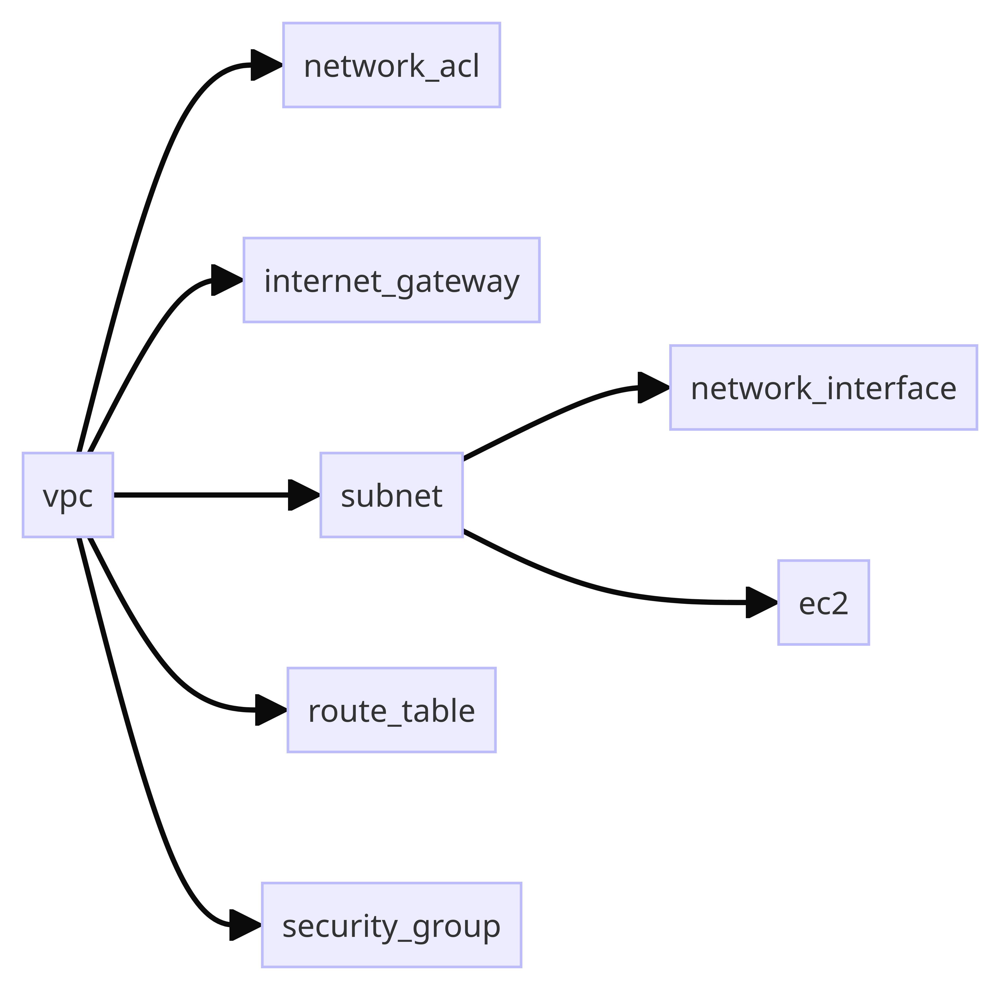
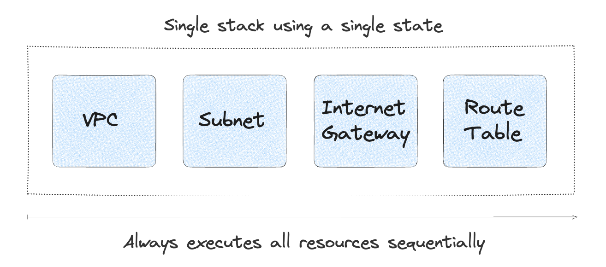
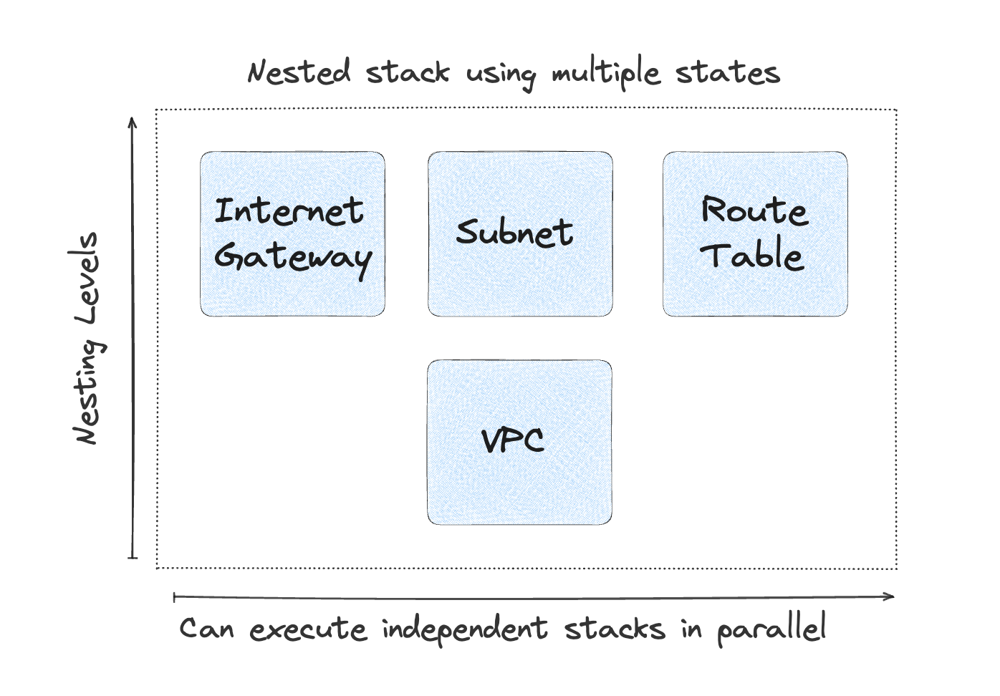
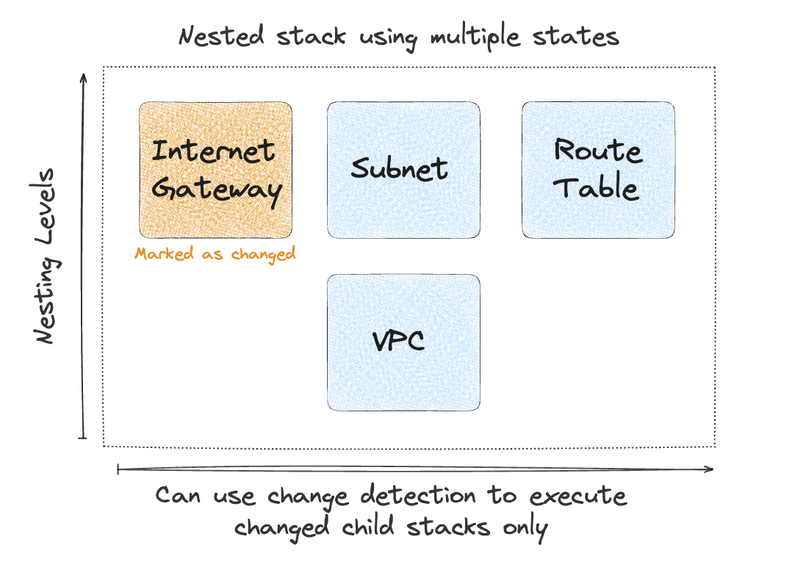

# Nesting Stacks

Terramate Stacks can be nested, allowing you to map your infrastructure code as a tree, which leads to a natural
organization of your infrastructure resources with Infrastructure as Code.

## What are nested Stacks?

Nesting stacks is a recommended best practice for grouping related infrastructure, such as environments or services, that should be treated as a unit.

By nesting stacks instead of managing all related infrastructure in a single stack, we can preserve the benefits of stacks even when working in large environments.

A simple example is launching an EC2 instance in AWS. The instance must be launched in a subnet, which must belong to a
VPC. If we illustrate this as nested stacks, the architecture would look something like this.



Which could be represented in a Terramate stack hierarchy as:

```sh
/vpc
  /network_acl
  /internet_gateway
  /subnet
    /network_interface
    /ec2
  /route_table
  /security_group
```

This tree structure following the directory hierarchy has three significant features:

- **The configuration is inherited from left to right:** a [Global Variable](../code-generation/variables/globals.md)
  defined in one stack is automatically inherited by all nested child stacks. This removes the need for brittle code,
  such as hardcoded values and allows you to have an ever-expanding *context* for resources as you descend further into the stack tree.
- **Execution of commands happens left to right (e.g. `terraform apply`):** In the example mentioned above, the
  VPC will automatically be created before the subnet using the
  [breadth-first search algorithm](https://en.wikipedia.org/wiki/Breadth-first_search), which will be created before the
  EC2 instance. This means a great reduction in explicit dependencies:
  you do not need to specify that the subnet depends upon the existing VPC - it's a natural outcome of the hierarchy
  (though we also support explicit dependencies with `wants`, `before` and `after` attributes in
  [stack configuration](./configuration.md)).
- **Cloning of stacks:** nested stacks can represent whole environments, services or single resources. A neat feature in
  Terramate is that stacks and nested stacks can easily be cloned using the
  [clone](../cmdline/experimental/experimental-clone.md) command.

::: tip
`terramate run` executed commands in stacks left-to-right using the
[breadth-first search algorithm](https://en.wikipedia.org/wiki/Breadth-first_search).
However, this behavior can be reversed using the `--reverse` algorithm which can be useful in certain scenarios,
e.g. when using `terraform destroy` .
For details please see the [run](../cmdline/run) command documentation.
:::

## Performance Improvements

Nesting stacks can lead to faster execution runtimes and reduced blast radius.
For example, the following diagram illustrates a single stack that manages all infrastructure code, state and configuration
required to deploy a VPC.



In comparison, managing a complex service such as a VPC as a nested stack would result in multiple child stacks,
each containing an isolated subset of the infrastructure code, state, and configuration required to manage all resources
related to the VPC.



This pattern allows us to use the [Terramate Change Detection](../change-detection/index.md). For example, if we were
to update the "Internet Gateway" after the initial deployment of the VPC, Terramate CLI can detect that only this
specific child stack has changed using `terramate run --changed -- <COMMAND>`.


