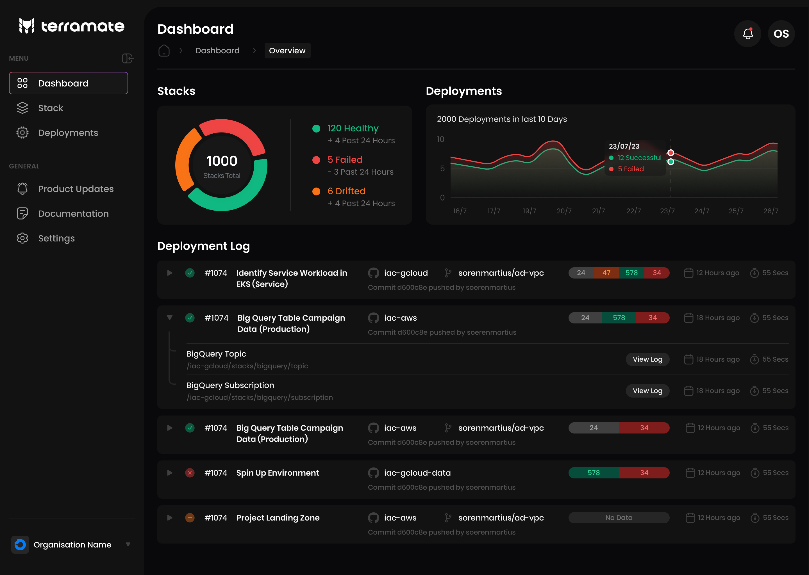

# Dashboard

The dashboard helps to keep an overview of the health of all stacks. In addition, it shows historical data about deployments.

## Health Donut

The Health Donut either shows the number of healthy stacks in case no stacks are unhealthy or the details about how many
stacks are in a `failed` state and how many stacks are in a `drifted` state.

## Deployment Graph

The Deployment Graph shows a visualization of stacks deployed over the last 14 days. It shows details per day of how many
stacks `failed` to deploy or succeeded.

## Last Deployments

To have a real-time activity overview of deployments that were running or are currently running, the list of the last
deployments shows details about deployment runs.

::: tip
Upcoming changes in the next Terramate Cloud Release will make the deployment lifecycle a top-level feature
and show Alerts instead of the last deployments here.
:::
