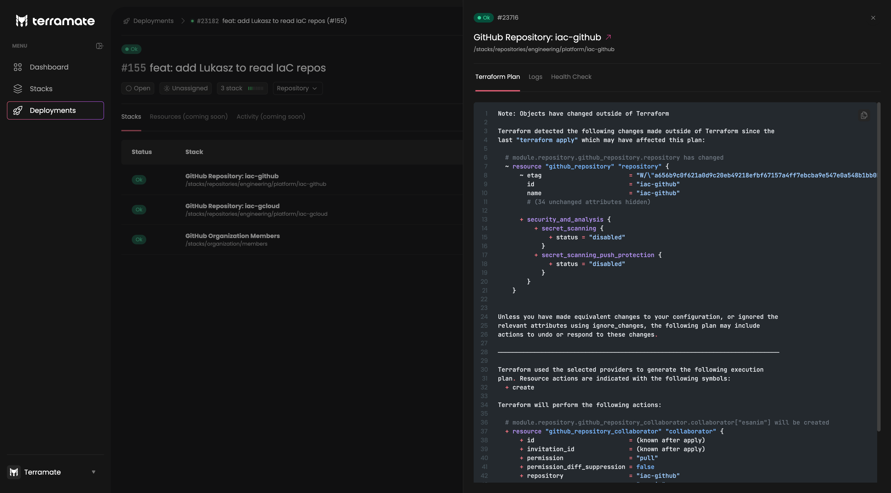

# Deployments and Deployment Visibility

In the deploy details page, all stack metadata is displayed as configured in Terramate CLI and collected by
Terramate Cloud. In addition to metadata, more information is displayed based on the stack status.

