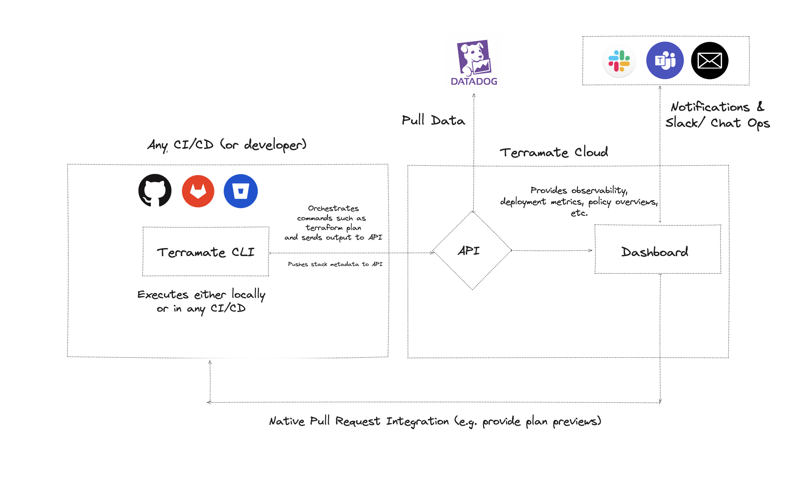

# Introduction

Terramate Cloud is a **collaboration**, **automation**, **visibility** and **observability** platform for Infrastructure as Code (IaC).

It's designed and implemented by long-time DevOps practitioners based on previous experience with large-scale installations - dozens of teams, hundreds of engineers, and tens of thousands of cloud resources.

At the same time, Terramate Cloud is super easy to start with - you can go from zero to fully managing your cloud resources within less than 10 minutes, with no pre-requisites. It integrates nicely with your existing tooling, such as GitHub or Slack.

We currently support Terraform and OpenTofu but plan to add support for more technologies such as Kubernetes, Pulumi, Cloudformation, CDK and others in the future.

## Features

- Automation and GitOps workflows in any CI/CD, including previews in Pull Requests
- Monitor many repositories
- Private runners - thanks to the fact that there are no separate runners! Your existing CI's compute environment is used
- Integrates with all third-party tooling such as infracost, OPA, checkov, tfsec, thrivy, etc.
- Drift Detection and Control
- Visibility to understand what infrastructure is managed in stacks, last deployments, drift runs, etc.
- Collaboration on Pull Requests, including comments on plans

## How does it work

Terramate Cloud receives data from [Terramate CLI](../../introduction.md) which is synced during commands such as
`terramate run` and others. The CLI runs on a developer's workstation or in any CI/CD, used to orchestrate and automate
Terraform or OpenTofu. The CLI syncs data such as Terraform plans, deployment metrics, metadata such as GitHub users
and much more. Based on this data the Terramate Cloud provides visibility insights, observability and enhanced collaboration which can
be natively integrated with Pull Requests in e.g. GitHub or GitLab.

::: tip
Terramate CLI never syncs any sensitive values in plan files such as secrets. Sensitive values are removed on the client
side before syncing them to the cloud. In fact, Terramate Cloud doesn't require access to any of your cloud accounts or infrastructure code.
:::

## How about CI/CD

Terramate Cloud is not a CI/CD platform! We believe teams don’t need to adopt yet another CI/CD vendor. Instead, we integrate seamlessly with any CI/CD system (e.g., GitHub Actions, GitLab CI/CD, BitBucket Pipelines, Azure DevOps, etc.), allowing you to reuse compute, security, logs, etc. This comes with a few benefits :

- **Enhanced Security** because Terramate Cloud doesn’t need access to any of your cloud environments
- **Cost-effective** because you are not paying for additional computing just to run your Terraform
- **Excellent Developer Experience** because they can stay in a GitHub native environment

If you're new to Terramate, please spend some time browsing through the pages in this documentation in the same order they appear in the menu. Start with the main concepts and follow with integrations. If you're more advanced, you can navigate directly to the article you need or use the search feature to find specific information. If you still have questions, feel free to [reach out to us](https://terramate.io/discord).
