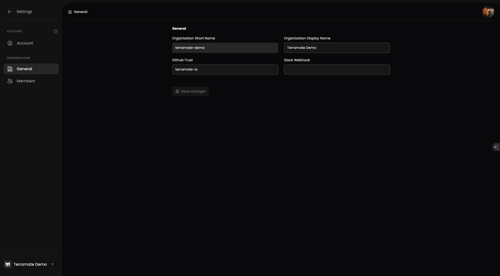

# General Settings

### Edit organization settings as an admin

An `admin` of the organization can update general organization settings.

- **Short Name** - The short name can not be changed. Please get in touch with our support for more details.

- **Display Name** - The display name shows the organization's name in various places. It is also part of emails we send to newly invited teammates to help them recognize the organization they are invited to.

- **GitHub Trust** - This field allows the specification of a trust relationship from GitHub Action workflows. The value of this field can be

  - a GitHub Organization/Owner to trust all repositories within a GitHub Organization of the form `owner`
  - a comma-separated list of GitHub Organizations/Owners of the form `ownerA,ownerB,ownerC`
  - a GitHub Repository to trust a single repository within a GitHub Organization of the form `owner/repository`

- **Slack WebHook URL** - This field is written only and will not display the currently set value. It can be used to set a new WebHook URL.
  To generate a Slack WebHook URL, please follow the instructions in the [Slack WebHook Documentation](https://opentffoundation.slack.com/apps/A0F7XDUAZ-incoming-webhooks).
  _This integration will be replaced with a Slack App._

### View organization settings as a member

A `member` of the organization can only read the organization settings but not change any settings.
