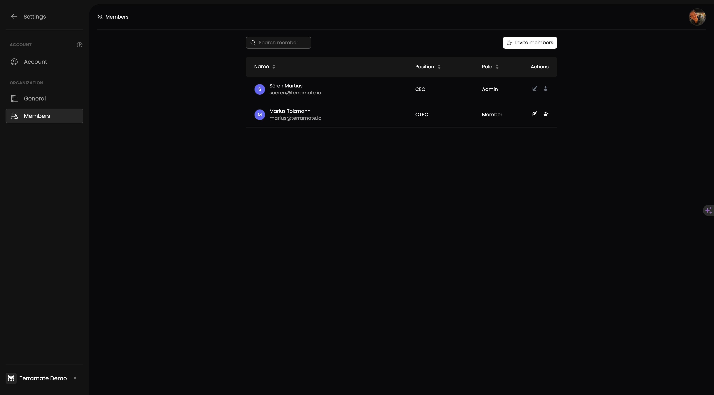

# User Management

To manage teammates, an `admin` can choose from the following actions, while a normal `member` can only see the list of teammates or leave an organization.

## Invite more teammates

To invite your team, activate the “Invite Members” button in the member's list and enter one or more email addresses in the dialog. Email addresses can be separated by commas, semicolons, white spaces, or new lines.

After confirming with the “Invite teammates” button, invitation emails will be sent to the newly invited teammates.

## Revoke an invitation

An invitation can be deleted at any time. Once an invitation is removed from the list, the user with this email can not join the organization after registration. An invitation has no time limit, and invited teammates can join the organization at any time as long as the invitation is not revoked.

To revoke an invitation, an `admin` can search or browse to the teammate and remove it from the list by activating the remove icon on the teammate's row.

No email will be sent to the teammate on revoking the invitation.

## Accept an invitation

To accept an invitation, you must visit the [Organization selection page](https://cloud.terramate.io/o) and activate the “Join” button on available organizations.

## Deactivate a teammate

After teammates become `active` `member`s of an organization, no invitation can be revoked anymore, and teammates need to be deactivated. 

To deactivate a teammate, an `admin` can search or browse the teammate and remove it from the list by activating the remove icon on the teammates row.

No email will be sent to the deactivated teammate.

## Reactivate a teammate

To reactivate a teammate, an `admin` can search or browse the teammate and reactivate it from the list by activating the reactivation icon on the teammates row. 

No email will be sent to the teammate, and the membership will be active again. You might want to adjust the role of the reactivated member as a next step.

## Leaving an organization

Every teammate can decide to deactivate themselves to leave the organization.

## Promote or demote your teammates

As an `admin` you can promote other teammates by granting them the `admin` role or demote other teammates by granting them the `member` role.

Only other teammates can be managed this way. You can not demote yourself. To drop the `admin` role, promote another teammate to `admin` and ask the teammate to demote you. This guarantees that your organization always has at least one administrator.

In case the only teammate having an `admin` role is not active anymore, and you need to promote a new admin, please get in touch with our support.

No email will be sent to the teammate when being demoted or promoted.
