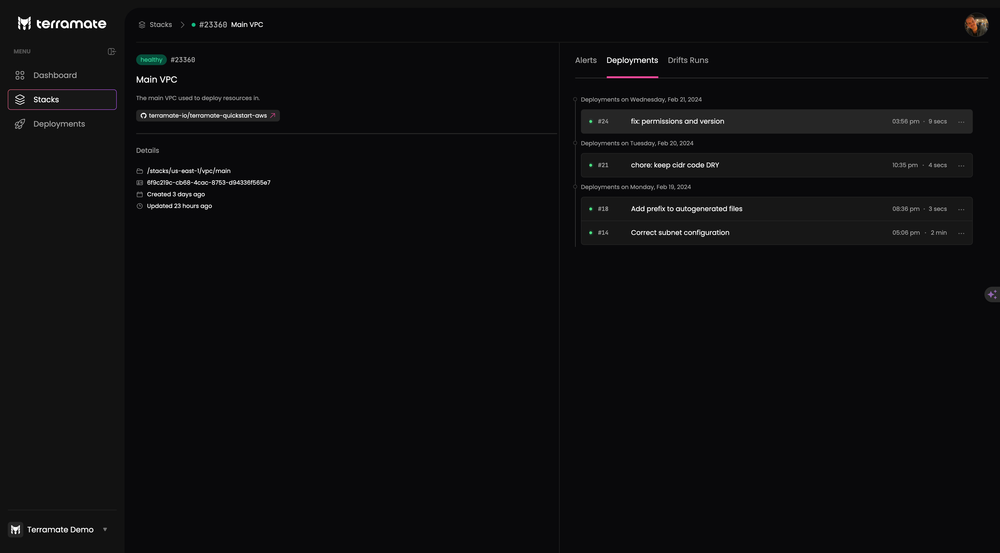

# Stack Details

In the stack details page, all stack metadata is displayed as configured in Terramate CLI and collected by Terramate Cloud.
In addition to metadata, more information is displayed based on the stack status.

## Stack Metadata

On the details page, the following information is available

- The **name** of the stack as set in the Terramate config via `stack.name`
- The **description** of the stack as set in the Terramate config via `stack.description`
- The **repository** the stack is contained in. When clicking on the repository name, a new ta will be opened, and you will be sent to the stack within the repository on GitHub.
- The **path** of the stack within the repository
- The ID of the stack as set in the Terramate config via `stack.id`
- The **created date and time** when the stack was created on Terramate Cloud
- The **updated date and time** when the stack status was last updated
- The **tags** configured for a stack via `stack.tags`

## Stack Alerts

For `failed` stacks deployment error logs are displayed showing details about the failed command and highlighting Errors. The error logs can be expanded to show the full context and all log lines of the deployment command. If an additional drift was detected, drift details in the form of a `terraform plan` are displayed, too.

For `drifted` stacks, drift details in the form of a `terraform plan` are displayed.

## Deployments

Each stack has a list of historic deployments the stack was included in.

This information helps to detect the deployment that introduces the `failed` state. Each deployment can be used to visit the deployment in GitHub.

See [Deployments](../deployments/) Visibility to learn how to synchronize deployments with Terramate Cloud.

## Drift Runs

Each stack has a list of historic drift runs the stack was included in.

This information helps to detect the point in time when a drift was first detected and if a drift was related to a specific deployment.

See [Drift Detection](../drifts/) to learn how to synchronize drift runs with Terramate Cloud.
