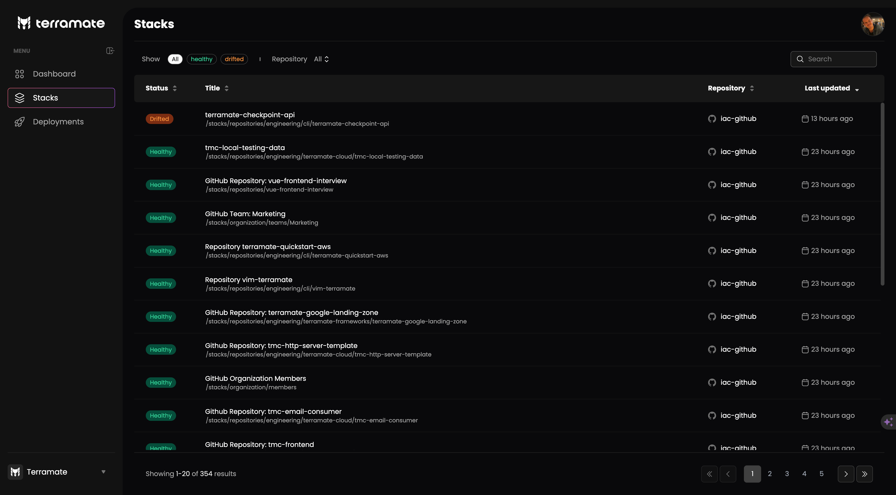

# Stacks List

The top-level navigation `Stacks` will list all known stacks over multiple repositories.

Each listed stack includes the name of the stack, the stack path and repository information.

In addition, the Stack Status is displayed.

Stacks are sorted by the time they have been last updated by default, but any other sorting can be applied.

Filters allow you to select stacks from specific repositories or stacks having a specific status.

In addition, stacks can be searched for, including a search string in the `name` or the `path`.

Selecting a Stack will open a [Stack Details](./details.md) page.
