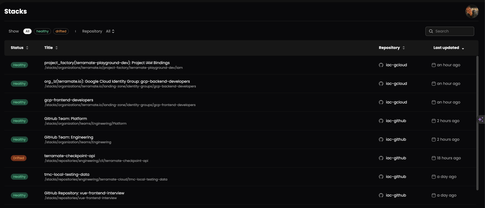

# Stack status

Each stack can be healthy or unhealthy (e.g. failed or drifted) depending on the result of deployments or drift runs.

## Healthy

A `healthy` stack was deployed successfully and does not have any detected drifts.

This is the desired status for all stacks, which would be the case in an ideal world.

In the Infrastructure as Code lifecycle, we face Previews of planned changes, Deployments of changes, and Drifts
identifying detected changes outside of code.

## Failed

A `failed` stack is considered `unhealthy`. This status is reached after deployment of the stack failed to apply the
planned changes successfully.

A `failed` stack can only become `healthy` again after a follow up deployment of the stack succeeds without errors or
when a drift run does not detect any differences between the desired configuration (Code) and applied configuration (Cloud).

If a deployment fails in a stack that is in `drifted` state, the stack status will be updated to `failed`.

An example of a deployment command is `terraform apply` which can either successfully apply planned changes or fail in
the process and leave the stack in a partially applied state.

## Drifted

A `drifted` stack is considered `unhealthy`. This status is reached after a drift run detects any differences between desired configuration (Code) and applied configuration (Cloud) on a `healthy` stack. 

If a drift is detected in a `failed` stack, the status will NOT be updated to `drifted` as the drift is expected.

When no drift is detected for a `failed` stack, the stack status will be set to `healthy` again. This change is considered to be auto-healing as no user interaction in form of a new deployment is required.
