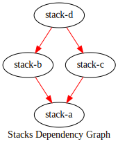
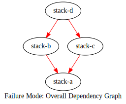
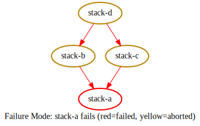
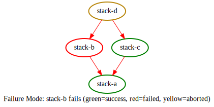

# Dependency Management

Sometimes stacks are completely independent of each other, but on
certain occasions it may happen that infrastructure that is created
by **stack A** is required by **stack B**, like using the outputs
of **stack A** as inputs for **stack B**.

This can be done through data sources (preferable, when available) or
by [loading the state](https://www.terraform.io/docs/language/state/remote-state-data.html)
of another stack. Independent on how you solve the problem, you need
an explicit way to communicate that changes on **stack A** can affect
**stack B**, so the order of execution of the stacks should always be:

* 1 - **stack A**
* 2 - **stack B**

To help with that terrastack provides a way to explicit declare
dependencies between stacks.

## Declaring Dependencies

Dependencies are declared inside the **stack** block using the
parameter **dependencies** which is a set of strings (**set(string)**),
where each string is a reference to another stack.

For example, let's assume we have a project organized like this:

```
.
├── stack-a
│   ├── main.tsk
│   └── version.tsk
└── stack-b
    ├── main.tsk
    └── version.tsk
```

And **stack-a/main.tsk** looks like:

```
stack {
    // variables definitions
}
```

Which doesn't depend on anything,
and then we have **stack-b/main.tsk**:

```
stack {
    dependencies = [
        "../stack-a"
    ]
    // variables definitions
}
```

This means that **stack-b** depends on **stack-a**.
The expression of this dependency impacts order of
execution of the stacks and also how change detection
works across stacks, which is defined along this doc,
but as far as defining dependencies goes, it is this easy.

## Order of Execution

For order of execution, let's discuss a more complex scenario.
Let's assume you have 4 stacks: **stack-a, stack-b, stack-c, stack-d**.

Organized like this on the local file system (omitted file names
for brevity):

```
.
├── stack-a
├── stack-b
├── stack-c
└── stack-d
```

Each stack is defined as follows:

stack-a:
```
stack {
    // variables definitions
}
```

stack-b:
```
stack {
    dependencies = [
        "../stack-a"
    ]
    // variables definitions
}
```

stack-c:
```
stack {
    dependencies = [
        "../stack-a"
    ]
    // variables definitions
}
```

stack-d:
```
stack {
    dependencies = [
        "../stack-b",
        "../stack-c",
    ]
    // variables definitions
}
```

This will produce the following dependency graph:



From the dependency graph, the total order of execution will be:

* 1 - stack-a
* 2 - (stack-b,stack-c)
* 3 - stack-d

In this case, since stack-b and stack-c are independent from
each other they don't have a defined order of execution between
then, meaning that you should not rely on an specific order and that it
will most likely be run concurrently. stack-d can only be
executed after both stack-b and stack-c have finished successfully.

### Change Detection

Change detection across stacks happens in the same way that change
detection works for imported modules. When a stack depend on a module,
if that module is detected as changed, the stack importing it is also
marked as changed.

For stack dependencies, the same behavior is expected. Lets say you
have **stack-b** depending on **stack-a**, if a change is detected
on **stack-a** then **stack-b** will also be marked as changed since
it depends on **stack-a**.

## Failure Modes

When managing multiple stacks it can happen that a specific
stack fails to be applied. If no other stack depends on a failed stack,
meaning no other stack depends on any infrastructure that was
supposed to be built by the failed stack, execution of other stacks
continues normally.

But if a stack has an explicit dependency and its dependency
fails to be applied, execution of the stack that depended on it
will be aborted, since it needs infrastructure that may not exist.

Lets work with a concrete example, lets say you have 4 stacks:

* stack-a
* stack-b -(depends)-> stack-a
* stack-c -(depends)-> stack-a
* stack-d -(depends)-> (stack-b, stack-c)

Which produces the following dependency graph:



Now assume none of the stacks have been applied yet
(all of them have changed, they are all new).

Given that, let's say **stack-a** execution fails, on
this case all other stacks get aborted since they depend
on **stack-a** (some directly, some transitively):



Given the same set of stacks/dependencies, let's assume that
**stack-b** failed, in this case the final result is:



Overall if any of the stacks a stack depend on fails, execution of the
stack will be aborted.


## What About Version Selection ?

TODO: Handle terrastack version selection like module define terraform versions ?
When actually running apply (terraform apply), how would different terraform
version requirements be handled? Enforce same terraform version ? Fail ?

Usually stacks have a fixed/pinned terraform version, since they apply changes,
but then running multiple stacks with **terraform run** using
terrastack would require all stacks to pin the exact same terraform version,
or it will fail for stacks with different versions.

This is not related only to dependencies, but dependencies also introduce the
idea of applying multiple stacks on one go (terrastack list + terraform run
has the same problem).


## What About Cycles ?

TODO: THIS IS STILL UNDEFINED, I MEAN, MORE UNDEFINED THAN THE REST FOR NOW =P

Make decided to drop cycles, for example, given:

```
.PHONY: stack-a
stack-a: stack-b
        @echo building stack-a

.PHONY: stack-b
stack-b: stack-a
        @echo building stack-b
```

For stack-a you get:

```sh
make stack-a
make: Circular stack-b <- stack-a dependency dropped.
building stack-b
building stack-a
```

For stack-b you get:

```
make stack-b
make: Circular stack-a <- stack-b dependency dropped.
building stack-a
building stack-b
```

It respects the first detected dependency, dropping cycles as they
are detected. Other than that the only alternative is to fail
and enforce the cycle to be removed (more clear/safer IMHO).


## Inspecting the Dependency Graph

TODO: THIS IS STILL UNDEFINED

ideas on generating graphviz fun. We could output
a dot file so anyone can use graphviz to see a graphical
representation of the dependencies.
