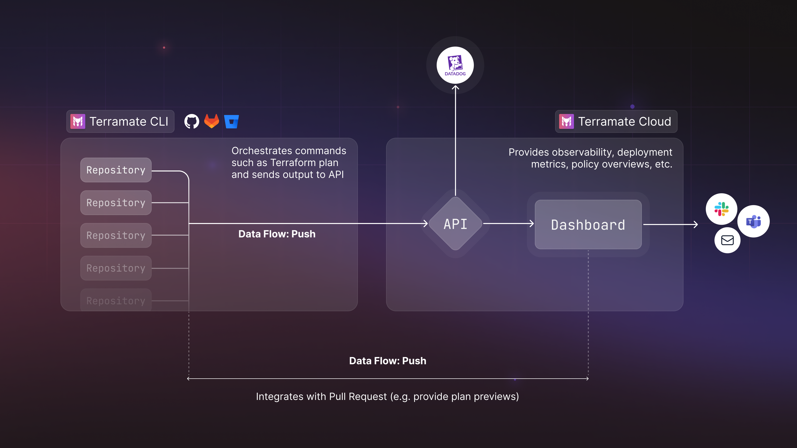

# How does Terramate work?

Terramate works with any existing IaC setup, all major CI/CD platforms and all of your existing tooling. Adding advanced
capabilities such as custom approval workflows, role-based security policies, and AI-powered observability that allow you
to turn your existing CI/CD into a powerful vending machine for self-service infrastructure with IaC in less than 5 minutes.

Terramate allows you to visualize, navigate, and observe your provisioned and deployed infrastructure resources and more.
With a UI, ChatOps Slack Bot for notifications and actionable observability, Terramate enables self-service infrastructure
that provides everything teams need for continuous delivery of their infrastructure with automated workflows that help
everyone understand the impact of proposed infrastructure changes.

## Terramate CLI and Terramate Cloud

The Terramate platform comprises two main components:

- **Terramate CLI**: An open-source Infrastructure as Code (IaC) orchestration and code generation tool for Terraform,
  OpenTofu, Terragrunt, Kubernetes, Pulumi, Cloud Formation, CDK, Azure Resource Manager (ARM), and others. Used by
  developers and in any CI/CD.

- **Terramate Cloud**: An Infrastructure as Code management platform that provides a control plane used to manage and observe
  all your infrastructure managed with IaC in stacks among one or multiple repositories. The platform provides a better
  **collaboration**, **observability**, **visibility**, and **governance** experience when managing cloud infrastructure
  with Infrastructure as Code. Terramate Cloud integrates seamlessly with all your tooling such as Slack or GitHub.

## What can you do with Terramate?

- Build, deploy, manage, and observe cloud infrastructure with IaC in one or multiple repositories.
- Configure fully customizable GitOps workflows that run in any CI/CD to streamline the deployment processes of your infrastructure.
- Automatically detect and resolve drift.
- Monitor, observe, and analyze what infrastructure is managed and by whom.
- Detect and resolve misconfigurations to prevent security vulnerabilities or costs.
- Provide better developer experience and self-service.

## How it works

Terramate CLI is used to orchestrate commands such as `terraform plan` in stacks and optionally sends data to Terramate Cloud.

Example: Run `terraform apply` in all changed stacks and sync the data to Terramate Cloud.

```sh
terramate run \
  --changed \
  --cloud-sync-deployment \
  --cloud-sync-terraform-plan-file=out.tfplan -- \
  terraform apply -input=false -auto-approve -lock-timeout=5m out.tfplan
```

Terramate Cloud will create a new deployment and provide insights about all stacks that have changed in the deployment
triggered by the command mentioned above. Execution can be done locally or in any CI/CD. Terramate Cloud accepts data
for various workflows, e.g., pull request previews, deployments, and drift runs, to mention a few. The data flow is ***push***
(from Terramate CLI to Terramate Cloud). Terramate doesn't need access to your code, state files or cloud accounts.
However, the Cloud provides a native Pull Request integration to enrich your pull request previews with additional data.

Please find the diagram below for a more detailed overview of how Terramate works.




## How to get started

1. Start by installing [Terramate CLI](https://github.com/terramate-io/terramate).
2. Add Terramate to any existing [Terraform](./cli/on-boarding/terraform.md), [OpenTofu](./cli/on-boarding/opentofu.md)
  or [Terragrunt](./cli/on-boarding/terragrunt.md) project. Or simply start with a [new project](./cli/getting-started/index.md)!
3. Instead of running `terraform apply` (or any other command), start using [`terramate run terraform apply`](./cli/cmdline/run.md).
4. Set up your CI/CD by using our [GitOps Automation Blueprints](./cli/automation/index.md).
5. [Sign up](https://cloud.terramate.io) for a free Terramate Cloud Account (or run `terramate cloud login`).
6. Sync your stacks to Terramate Cloud.
7. Connect Slack, GitHub, or GitLab, configure workflows, drift detection, and notifications.
8. Onboard your team, onboard more repositories, and explore!
